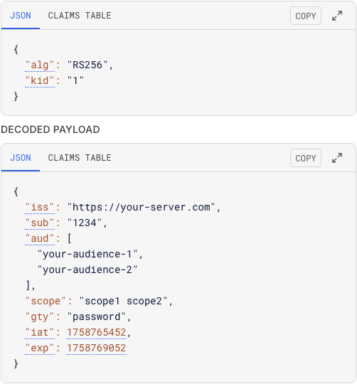
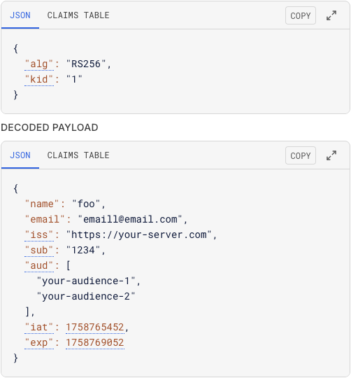

# mock-oauth

Generate fake OAuth access tokens/ID tokens that your resource server can accept. 

Can be used through our cloud service at [`https://mock-oauth.arraybrook.com/`](https://mock-oauth.arraybrook.com/). Or since this project is open sourced, you can customize and deploy to your own service from [our source code](https://github.com/arraybrook/mock-oauth).

## Token generation

```bash
curl -X POST https://mock-oauth.arraybrook.com/oauth/token \
--data-raw '{
  "iss": "https://your-server.com",
  "aud": ["your-audience-1", "your-audience-2"],
  "scope": "scope1 scope2",
  "gty": "password",
  "email": "emaill@email.com", 
  "sub": "1234", 
  "name": "foo"
}'
```
and it returns `{"access_token":"***","id_token":"***","expires_in":3600,"token_type":"Bearer"}%`. Tokens always has 1 hour TTL and cannot be refreshed.

Access token can includes `iss`, `sub`, `aud`, `scope`, `gty`, `azp` claims. All of them are optional. `iss` defaults to `"https://mock-oauth.arraybrook.com/"` and `aud` defaults to `["com.arraybrook.mock-oauth"]` if no value is provided. Other inputs are ignored.



ID token can include the below claims: `name`, `given_name`, `family_name`, `middle_name`, `nickname`, `preferred_username` `profile`, `picture`, `website`, `email`, `email_verified`, `gender`, `birthdate`, `zoneinfo`, `locale`, `phone_number`, `phone_number_verified`, `address`, `updated_at`, `iss`, `sub`, `aud` (the list of standard claims defined in [OpenID Connect contract](https://openid.net/specs/openid-connect-core-1_0.html#StandardClaims)). Other inputs are ignored.



## Resource server integration

JWKS URI is [`https://mock-oauth.arraybrook.com/.well-known/jwks.json`](https://mock-oauth.arraybrook.com/.well-known/jwks.json). The public key will be refreshed every time this service restarts, but that doesn't matter since the tokens only have 1 hour TTL and cannot be refreshed.

This example shows how to integrate mock-oauth with Spring Framework.
```yaml
spring:
  security:
    oauth2:
      resourceserver:
        jwt:
          issuer-uri: https://your-server.com
          jwk-set-uri: https://mock-oauth.arraybrook.com/.well-known/jwks.json
          jws-algorithm: RS256
          audiences:
            - your-audience-1
            - your-audience-2
```

## Use cases

mock-oauth can be used for testing proposes. 

mock-oauth can also be used for issueing temperarily tokens for anonymouse users. 

## License

MIT License. Source code at [`https://github.com/arraybrook/mock-oauth`](https://github.com/arraybrook/mock-oauth).